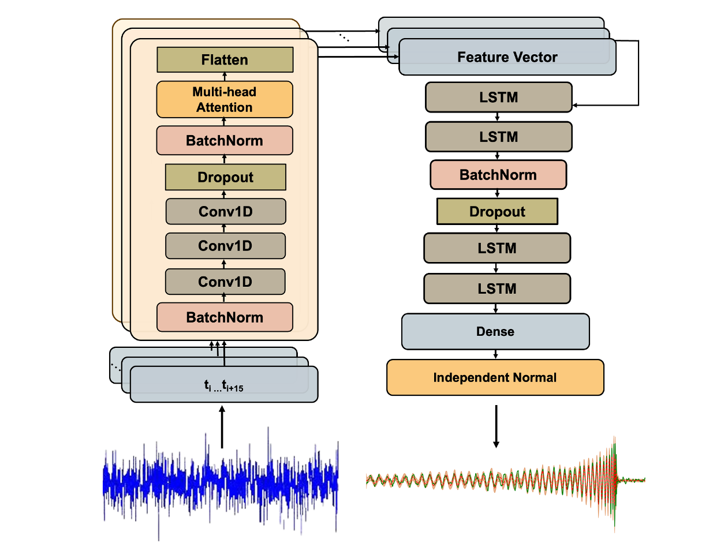

# AWaRe - Attention-boosted Waveform Reconstruction network
This repository contains code for generating rapid reconstructions of binary black hole gravitational wave signals from noisy LIGO detector data using deep learning. Our model, called AWaRe, or Attention-boosted Waveform Reconstruction network, is based on an Encoder-Decoder architecture with a probabilistic output layer that produces reconstructions of gravitational waves with associated uncertainties, in less than a second. The Encoder model, consisting of convolutional layers takes as input a 1 sec long segment of whitened noisy LIGO strain data, and generates embeddings which are enhanced by a multi-head self-attention module. The Decoder network, consisting of a stack of Long Short-Term Memory layers, uses the embeddings from the Encoder to produce the reconstructed whitened pure waveform.

The architecture of the AWaRe model is shown below: :


## Dependencies

This package requires the following packages:
- numpy
- pandas
- matplotlib
- tensorflow
- tensorflow-probability
- scipy
- pycbc

## Installation

To install this package, first clone this repository using:
```
git clone https://github.com/chayanchatterjee/AWaRe.git
```
Then create a Python virtual environment for AWaRe and activate it:
```
python -m venv aware-env
source aware-env/bin/activate
```
Install AWaRe in this virtual environment by running:

```
cd AWaRe
pip install -e .
```

## Usage

To generate reconstructions using AWaRe and plot the results, run:
```
aware-evaluate --test_filename test_data.hdf --test_index 0 --detector both --add_zoom_plot 1
```
This command will read the input strain data from ```test_data.hdf``` located in the folder ```evaluation/Test_data``` and plot the reconstruction for the data at index ```0``` for ```both``` H1 and L1 detectors. The entry ```1``` at the end means, we want to plot a zoomed-in version of the plots. The program will then prompt you to enter the number of seconds before and after the merger you want to zoom in. If you want to plot the reconstruction of either H1/L1 detector signal, replace ```both``` with ```H1``` or ```L1```. 

In order to test AWaRe on your own data, please generate an HDF file in the same format as ```evaluation/Test_data/test_data.hdf```. The whitened noisy strain data should be stored under group 'injection_samples' and named 'h1_strain'/'l1_strain'. The whitened pure signal should be stored under group 'injection_parameters' and named 'h1_signal_whitened'/'l1_signal_whitened'. The power spectral density data needs to be stored under 'injection_parameters', with the name 'psd_noise_h1'/'psd_noise_l1'.

The generated plots will then be saved in the directory ```evaluation/Plots```. 

## Citation

If you use this code please give credit by citing the following papers:
1. [Chatterjee and Jani 2024](https://arxiv.org/abs/2403.01559).
2. [Chatterjee and Jani 2024](https://arxiv.org/abs/2406.06324).
